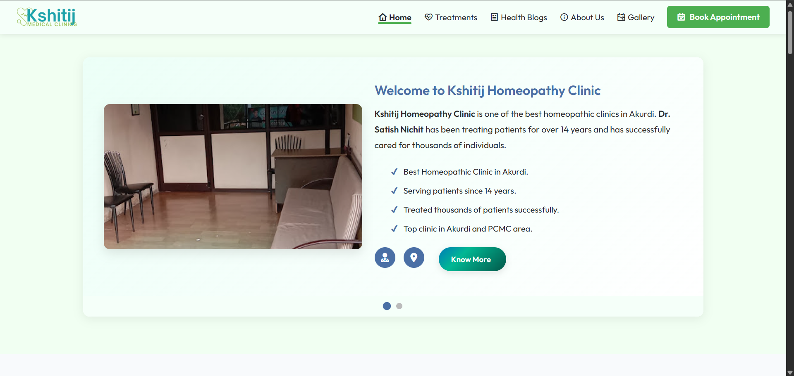
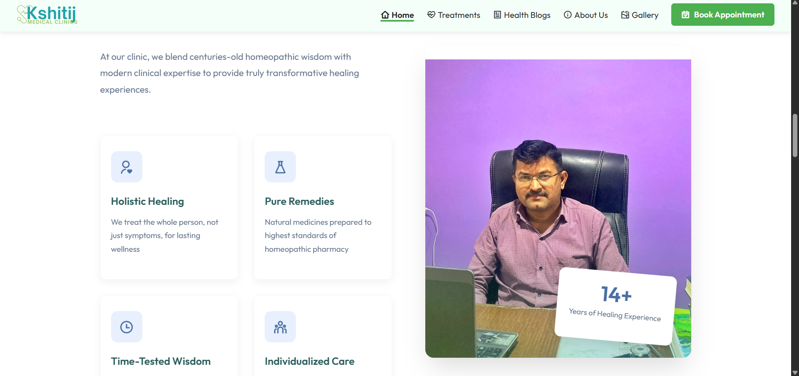
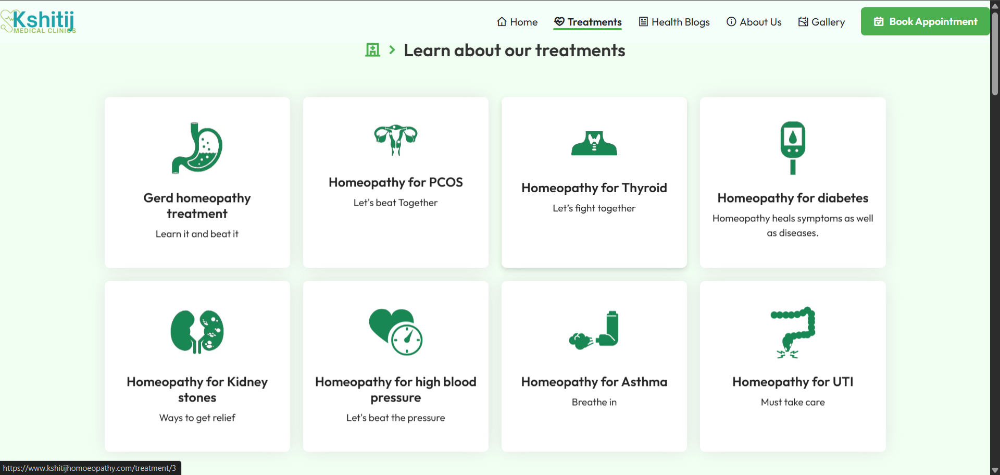
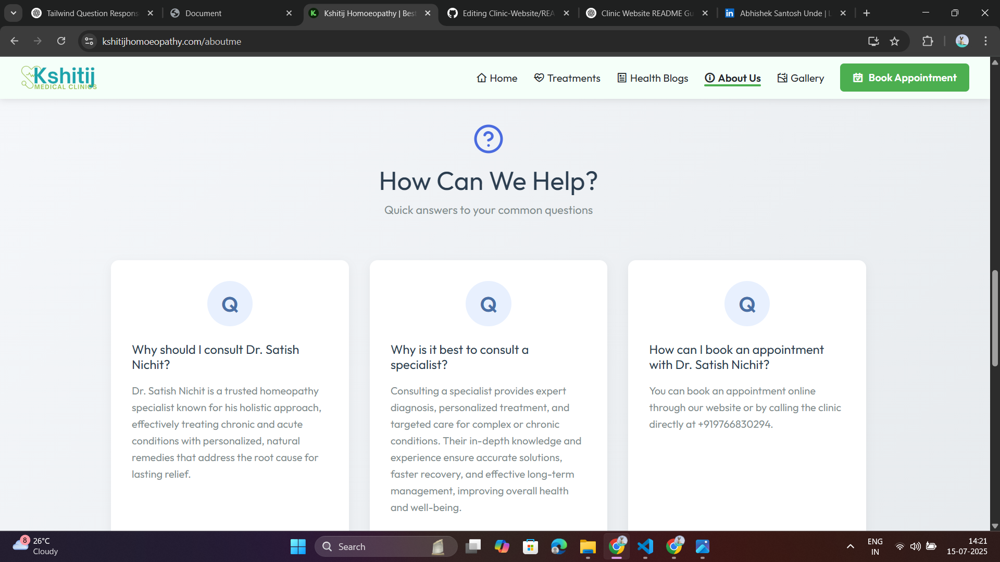

# 🏥 ClinicPro – Kshitij Homeopathy Website

A modern, responsive clinic website developed for **Kshitij Homeopathy Clinic** to help patients explore services, learn about the doctor, and request appointments easily.  
This live production site was built as a freelance MERN-stack project, designed with a mobile-first approach and clean UX.

🔗 **Live Site**: [www.kshitijhomoeopathy.com](https://www.kshitijhomoeopathy.com/)  
📦 **Repo**: [github.com/Abhishek1380/ClinicPro](https://github.com/Abhishek1380/ClinicPro)

---

## ✨ Key Features

- ✅ Clean, responsive UI (mobile, tablet, desktop)
- 🧑‍⚕️ Doctor profile, credentials, and clinic intro
- 📅 Appointment form (email + backend API)
- 🗺️ Google Maps clinic location
- ⚙️ Optimized for SEO + performance

---

## 🔧 Tech Stack

| Tech        | Purpose                          |
|-------------|----------------------------------|
| React.js    | Frontend UI                      |
| Node.js     | Backend server                   |
| Express.js  | API for appointment form         |
| MongoDB     | Stores appointment entries       |
| Render      | Backend hosting                  |
| Vercel      | Frontend hosting                 |
| Hostinger   | Domain management                |

---

## 📸 Screenshots

  
  
  
  

---

## 🚀 Hosting Setup

| Part       | Platform    |
|------------|-------------|
| Domain     | Hostinger   |
| Frontend   | Vercel      |
| Backend    | Render      |

---

## 💼 About the Project

This project was developed as a **freelance commission** for a live clinic.  
The client wanted a clean, mobile-friendly website that could be used by both new and existing patients to explore treatments and request consultations.  
It currently operates in production.

---

## 👨‍💻 Developer Info

**Abhishek Santosh Unde**  
📧 Email: undeabhishek91@gmail.com  
🔗 [LinkedIn](https://www.linkedin.com/in/abhishek-santosh-unde-434212346)  
💻 [GitHub](https://github.com/Abhishek1380)

---

## 🙏 Acknowledgment

Special thanks to **Kshitij Homeopathy Clinic** for trusting me with their digital platformm.

---
